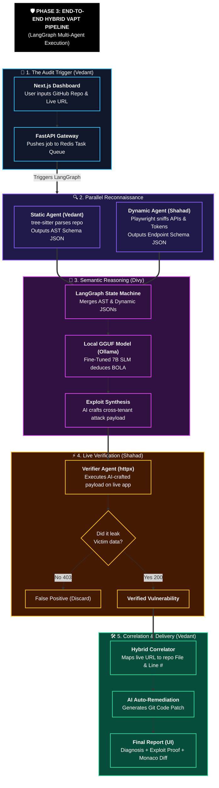

# AegisAi

| **Parameter** | **Details** |
| --- | --- |
| **Project Title** | **AegisAI — Autonomous Multi-Agent Framework for Hybrid Application Security (VAPT)** |
| **Domain** | Application Security (AppSec), Autonomous Multi-Agent Systems, Applied Deep Learning (PEFT / QLoRA) |
| **Academic Term** | Semester 5 (2026–2027), GTU-GSET |
| **Team Members** | **Vedant Chauhan (Lead)**, **Shahad**, **Divy** |
| **Faculty Guide** | **Dr. Deepak Upadhyay** |

## 1. Executive Summary & Core Innovation

Modern web application security auditing is split into two isolated, inefficient silos:

1. **Static Analysis (SAST)** *(e.g., Snyk, CodeQL)*: Inspects code on GitHub, but flags numerous false alarms because it cannot verify whether vulnerable code paths are actually reachable or exploitable on a running server.
2. **Dynamic Analysis (DAST)** *(e.g., Burp Suite, Acunetix)*: Attacks running web URLs from the outside, but is blind to internal code—it cannot pinpoint repository file paths, line numbers, or write code fixes.
3. **The Business Logic Blindspot:** Both traditional methods rely heavily on rigid regex patterns, fixed signatures, and dictionary fuzzing, consistently missing complex, multi-step authorization flaws like **BOLA/IDOR (OWASP API Top 10 #1)**.

### 🌟 The Core Innovation:

**AegisAI bridges this divide.** It is an autonomous, AI-driven VAPT platform that:

- Accepts a **GitHub Repository**, a **Live Web URL**, or **Both (Hybrid Mode)**.
- Uses an open-source, locally **Fine-Tuned Small Language Model (SLM)** (7B/8B code model via QLoRA) to understand context, multi-user access rules, and business logic.
- Delivers **Full-Cycle Reasoning**: **(1) Diagnosis** of the root cause, **(2) Live Exploit Payload** proof, and **(3) Remediated Code Patch** ready to merge into GitHub.

## 2. The 3 Execution Modes


## 3. End-to-End System Architecture

The platform runs on a coordinated **Multi-Agent Pipeline**:

.jpg)

## 4. Industry Benchmark & Feature Comparison

| **Capability / Security Feature** | **Burp Suite (PortSwigger)** | **Acunetix (Invicti)** | **AegisAI (Our Project)** |
| --- | --- | --- | --- |
| **Workflow Style** | Manual Proxy Workstation | Automated DAST Scanner | **Autonomous Multi-Agent VAPT** |
| **Manual HTTP Intercept & Repeater** | ✅ **YES** | ❌ NO | ❌ NO (Autonomous) |
| **Web Crawling (SPA / React / Vue)** | ⚠️ Partial / Manual | ✅ **YES** *(DeepScan)* | ✅ **YES** *(Playwright Agent)* |
| **Classic Fuzzing (SQLi, XSS)** | ✅ **YES** *(Intruder)* | ✅ **YES** | ✅ **YES** *(Targeted AI Fuzzing)* |
| **GitHub Source Code Ingestion (SAST)** | ❌ NO | ❌ NO | ✅ **YES** |
| **Server Runtime Agent Required (IAST)** | ❌ NO | ⚠️ **YES** *(AcuSensor)* | ✅ **NO (Non-Invasive Git Parse)** |
| **AI BOLA / Business Logic Reasoning** | ⚠️ Human tester needed | ❌ Fails on logic | ✅ **YES (Fine-Tuned SLM)** |
| **Exact Source File & Line Number Mapping** | ❌ NO | ⚠️ Only with AcuSensor | ✅ **YES (Hybrid Correlator)** |
| **Automated Git Code Patch Diff** | ❌ NO | ❌ NO | ✅ **YES (Merge-Ready Pull Request)** |
| **Autonomous Multi-Agent Flow** | ❌ NO | ❌ NO | ✅ **YES (LangGraph Engine)** |

## 6. Technical Stack & Hardware Profile

- **Frontend Dashboard:** Next.js, React, Tailwind CSS (Interactive Scan Visualizer & Monaco/Diff Viewers)
- **Backend Gateway:** FastAPI (Python), Async HTTPX, Redis Task Queue
- **Dynamic Crawler:** Microsoft Playwright (Headless Chromium for API network sniffing)
- **Static Analysis:** Python `tree-sitter` for JavaScript/TypeScript AST extraction
- **AI Framework & Model:** `Qwen2.5-Coder-7B-Instruct` or `Llama-3.1-8B-Instruct` fine-tuned with **QLoRA (4-bit quantization)** via `peft`, `trl`, and `Unsloth`
- **Agent Framework:** LangGraph

## 7. The 30-Second Elevator Pitch

> *"AegisAI is an autonomous, AI-driven VAPT platform that bridges static code analysis with live dynamic penetration testing. When provided with a GitHub repo and a live web URL, its autonomous Playwright crawler maps routes while a locally fine-tuned 7B/8B code model r detects complex authorization flaws like BOLA. It actively verifies the exploit across multi-user sessions to eliminate false alarms, pinpoints the exact file and line number in the GitHub repo, and outputs a merge-ready code patch."*
> 

PHASES OF PROJECT

.jpg)

**PHASES IN DETAIL**

PHASE 1:e

.jpg)

PHASE 2:

.jpg)

PHASE 3:



PHASE 4:

```mermaid
flowchart TB
    %% STYLING
    classDef testbed fill:#0f172a,stroke:#38bdf8,stroke-width:2px,color:#fff;
    classDef bench fill:#1e1b4b,stroke:#8b5cf6,stroke-width:2px,color:#fff;
    classDef metrics fill:#311042,stroke:#d946ef,stroke-width:2px,color:#fff;
    classDef ui fill:#451a03,stroke:#fbbf24,stroke-width:2px,color:#fff;
    classDef final fill:#064e3b,stroke:#34d399,stroke-width:2px,color:#fff;

    Title["<b>🏁 PHASE 4: BENCHMARKING, VALIDATION & FINAL DELIVERY</b><br/>(Empirical Evaluation & Defense Preparation)"]
    style Title fill:#000,stroke:#fff,stroke-width:2px,color:#fff,font-size:16px

    %% STEP 1: TESTBEDS
    subgraph S1 ["🧪 1. Benchmark Testbeds (Shahad + Vedant)"]
        direction TB
        T1["<b>OWASP crAPI</b><br/>Microservices BOLA Target"]
        T2["<b>OWASP Juice Shop</b><br/>Node.js SPA Access Flaws"]
        T3["<b>Custom Ground-Truth Repo</b><br/>10 Verified Authorization Bugs"]
        T1 ~~~ T2 ~~~ T3
    end

    %% STEP 2: BENCHMARKING
    subgraph S2 ["📊 2. Comparative Benchmark (Shahad)"]
        direction TB
        B1["<b>Burp Suite Pro</b><br/>Manual Proxy + Active Scan"]
        B2["<b>Acunetix</b><br/>Automated Dynamic DeepScan"]
        B3["<b>AegisAI</b><br/>Autonomous Multi-Agent Scan"]
        B1 ~~~ B2 ~~~ B3
    end

    %% STEP 3: METRICS & ABLATION
    subgraph S3 ["🔬 3. Metrics & Ablation (Divy)"]
        direction TB
        M1["<b>Confusion Matrix:</b><br/>Precision, Recall, FPR Rate"]
        M2["<b>Model Ablation:</b><br/>Base 7B vs Fine-Tuned 7B"]
        M3["<b>Latency Benchmarks:</b><br/>Token speed & scan duration"]
        M1 --> M2 --> M3
    end

    %% STEP 4: UI & DEPLOY
    subgraph S4 ["💻 4. UI Polish & Packaging (Vedant)"]
        direction TB
        P1["<b>Docker Compose Bundle:</b><br/>FastAPI + Redis + Next.js UI"]
        P2["<b>Monaco Diff Viewer:</b><br/>Interactive before/after patches"]
        P3["<b>PDF Audit Export:</b><br/>One-click executive report"]
        P1 --> P2 --> P3
    end

    %% STEP 5: FINAL OUTPUTS
    subgraph S5 ["🎓 5. Academic Defense Deliverables"]
        direction TB
        D1["<b>Comprehensive Project Report:</b><br/>Architecture, Math, Evaluation"]
        D2["<b>Live Interactive Demo:</b><br/>Single-click full scan execution"]
        D3["<b>Defense Slide Deck:</b><br/>Benchmark tables & ROI summary"]
        D1 ~~~ D2 ~~~ D3
    end

    %% CONNECTIONS
    Title ~~~ S1
    S1 ==>|Deploy Targets to| S2
    S2 ==>|Feed Raw Scan Logs to| S3
    S3 ==>|Embed Evaluation Data into| S4
    S4 ==>|Stage System for| S5

    %% APPLY STYLING
    class S1,T1,T2,T3 testbed;
    class S2,B1,B2,B3 bench;
    class S3,M1,M2,M3 metrics;
    class S4,P1,P2,P3 ui;
    class S5,D1,D2,D3 final;
```



- Version control (IMP) (Precaution needed)
    
    # 🔀 AegisAI Version Control Protocol (Zero-Conflict Strategy)
    
    ## 🛑 RULE 1: The "Stay in Your Lane" Policy
    
    The biggest advantage of our Monorepo is directory isolation.
    
    - **Vedant** is ONLY allowed to modify files inside `/frontend` and `/backend`.
    - **Shahad** is ONLY allowed to modify files inside `/crawler_dast`.
    - **Divy** is ONLY allowed to modify files inside `/ai_engine`.
    - **Root Files (like `.gitignore` or `README.md`):** Only Vedant edits these. If Shahad or Divy need something added to `.gitignore`, they must ask Vedant.
    
    > *If you strictly follow this rule, it is mathematically impossible to get a merge conflict on your code files.*
    > 
    
    ## 🌿 RULE 2: The Branching Strategy
    
    We will use a 3-tier branching system. **Nobody ever pushes directly to `main`.**
    
    1. **`main` (Locked):** This is the holy grail. It only contains 100% working, demo-ready code.
    2. **`dev` (Integration):** This is where everyone's code merges together. You branch *off* of `dev`, and you merge *back* into `dev`.
    3. **`feature/` (Your Workspace):** Every new task gets its own branch.
        - *Format:* `feature/<your-name>-<task>`
        - *Example:* `feature/vedant-fastapi-setup`, `feature/shahad-login-sniffer`, `feature/divy-dataset-clean`
    
    ## 🔄 RULE 3: The Daily Git Routine (Memorize This)
    
    Whenever you sit down at your PC to start working, run these exact commands in your terminal:
    
    **1. Update your local machine with everyone else's work:**
    
    Bash
    
    ```
    git checkout dev
    git pull origin dev
    ```
    
    **2. Create a new branch for what you are working on today:**
    
    Bash
    
    ```
    git checkout -b feature/yourname-todays-task
    ```
    
    **3. Do your coding. When finished, save your work:**
    
    Bash
    
    ```
    git add .
    git commit -m "Added multi-session login for crawler"
    git push origin feature/yourname-todays-task
    ```
    
    **4. Go to GitHub and open a Pull Request (PR) from your feature branch into `dev`.**
    
    - Tag another team member to click "Approve" and "Merge". This takes 2 minutes and prevents accidental breaks.
    
    ## 🛡️ RULE 4: The `.gitignore` Mandate (CRITICAL)
    
    If someone accidentally pushes a 5GB AI model or a 500MB `node_modules` folder to GitHub, it will break the repository and block everyone from pulling.
    
    Vedant must ensure the root `.gitignore` contains these exact lines on Day 1:
    
    Plaintext
    
    ```
    # Node.js
    frontend/node_modules/
    .next/
    
    # Python & Virtual Environments
    venv/
    __pycache__/
    *.pyc
    
    # Environment Variables (NEVER push API keys)
    .env
    
    # AI Models & Large Files (Divy's Workspace)
    *.gguf
    *.bin
    *.safetensors
    ai_engine/datasets/raw/
    ```
    
    ## 🚨 What happens if we DO get a Merge Conflict?
    
    If you and another teammate somehow edit the same file (e.g., `requirements.txt`), Git will stop your `pull` or `merge` and show a conflict.
    
    1. **DO NOT panic and DO NOT force push (`git push -f`).**
    2. Open the file in VS Code. VS Code will highlight the conflict in green (Current Change) and blue (Incoming Change).
    3. Click **"Accept Both Changes"** (if both packages are needed) or manually fix the text.
    4. Run `git add .` and `git commit -m "Resolved merge conflict"` to finish.
- More precaution
    
    ## 🔒 1. The Secrets Precaution (Preventing Credential Leaks)
    
    **The Risk:** Someone hardcodes a database password, a Hugging Face API token, or a JWT secret directly into a Python or JS file and pushes it to GitHub. Even in a private repo, this is a massive security failure (especially for a cybersecurity project!).
    **The Fix:**
    
    - **Never commit a `.env` file.** Ensure `.env` is inside your `.gitignore`.
    - **Use `.env.example`:** Vedant should create a file named `.env.example` that contains dummy values (e.g., `DATABASE_URL=mongodb://localhost:27017/aegis`).
    - When Shahad and Divy clone the repo, they copy `.env.example`, rename it to `.env`, and put their own local passwords in it.
    
    ## 🐘 2. The "Large File" Trap (Preventing Git Freezes)
    
    **The Risk:** Divy trains the 4.5 GB `.gguf` model and accidentally runs `git add .` and `git commit`. GitHub enforces a strict **100 MB file size limit**. The push will fail, but the 4.5 GB file is now trapped in Git's local history. Untangling a stuck large commit takes hours and often requires deleting the local repo and starting over.
    **The Fix:**
    
    - **Strict `.gitignore` enforcement:** Ensure `.gguf`, `.bin`, `.safetensors`, and the `/datasets/raw/` folders are heavily ignored.
    - **Alternative Storage:** Transfer model weights exclusively via **USB Drive** or upload them directly to the **Hugging Face Hub** using `huggingface-cli`. Never use Git for AI weights or 1GB+ JSON datasets.
    
    ## 🧩 3. The JSON Contract Precaution (Preventing Integration Crashes)
    
    **The Risk:** Vedant writes the backend expecting Shahad's crawler to output a key called `"endpoint_url"`. But Shahad writes his crawler to output `"target_url"`. When you connect them in Phase 3, the entire application crashes due to a `KeyError`.
    **The Fix:**
    
    - **Lock the "API Contract" on Day 1.**
    - Vedant creates a file in the repo called `schemas/crawler_output_example.json` with dummy data.
    - Shahad's crawler *must* perfectly match that structure. Vedant's backend *must* parse that exact structure. If anyone wants to change a key name, they must call a team meeting to approve the change.
    
    ## 🧹 4. The Shared College PC Precaution (Preventing Lab Disasters)
    
    **The Risk:** You train the model on the college's 12GB GPU. The bell rings, you log out, and the next day you find out a lab admin wiped the PC, or another student used your logged-in Hugging Face account.
    **The Fix:**
    Establish a strict **"Burn Notice"** protocol for the last 10 minutes of your lab session:
    
    1. Copy the `.gguf` weights to a physical USB drive.
    2. Run `huggingface-cli logout` and `wandb logout` in the terminal to kill your sessions.
    3. Delete the `aegis-ai` folder from the college desktop/SSD entirely. Leave no trace of your code or credentials on the shared machine.
    
    ## 📦 5. The "Works on My Machine" Precaution (Dependency Drift)
    
    **The Risk:** The project works perfectly on Vedant's PC, but when Shahad tries to run the FastAPI backend, it crashes because he is using Python 3.9 and Vedant used Python 3.11 features.
    **The Fix:**
    
    - **Python:** Everyone installs Python 3.11. Create a virtual environment (`python -m venv venv`) and always run `pip freeze > requirements.txt` before pushing.
    - **Node.js:** Everyone installs Node v20 LTS. Commit a `.nvmrc` file containing the number `20` in the frontend folder.
    - **Docker fallback:** Since you already plan to use Docker for Juice Shop, if local dependencies become a nightmare later, Vedant can "dockerize" the FastAPI backend so it runs identically on every machine.
-