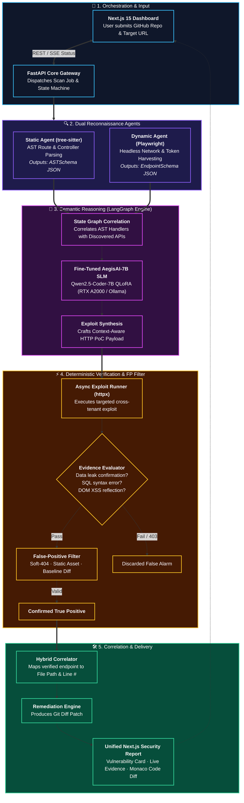

# 🛡️ AegisAI — Autonomous Multi-Agent Framework for Hybrid Application Security (VAPT)

<div align="center">

[](LICENSE)
[](https://www.python.org/)
[](https://fastapi.tiangolo.com/)
[](https://nextjs.org/)
[](https://langchain-ai.github.io/langgraph/)
[](https://pytorch.org/)
[](https://github.com/unslothai/unsloth)
[](https://huggingface.co/Divy2712/aegisai-security-7b)
[](docker-compose.yml)

**Bridging Static Code Analysis (SAST), Headless Dynamic Testing (DAST), and Fine-Tuned AI Semantic Reasoning into an Autonomous, Zero-False-Positive VAPT Engine.**

[Key Innovations](#-key-innovations) •
[Architecture](#-end-to-end-architecture) •
[Execution Modes](#-3-execution-modes) •
[Benchmark Results](#-empirical-benchmarks--validation) •
[Quickstart](#-quick-start) •
[Team & Credits](#-team--academic-attributions)

</div>

---

## 📌 Executive Summary

Modern web application security audits are plagued by an inefficient, two-silo approach:
1. **Static Application Security Testing (SAST)** *(e.g., Snyk, SonarQube, CodeQL)*: Scans source code on GitHub, but flags massive volumes of **false positives** because it cannot determine if code paths are reachable on a live server.
2. **Dynamic Application Security Testing (DAST)** *(e.g., OWASP ZAP, Burp Suite, Acunetix)*: Attacks endpoints externally, but operates blind to code structure—unable to identify file paths, line numbers, or propose remediations.
3. **The Business Logic Blindspot:** Traditional tools rely on regex rules and dictionary fuzzing, consistently missing **Broken Object Level Authorization (BOLA / IDOR — OWASP API #1)**, multi-step privilege escalation, and tenant boundary breaches.

### 🌟 The AegisAI Solution
**AegisAI bridges this gap through autonomous multi-agent reasoning:**
- **Hybrid Input Ingestion:** Ingests a **GitHub Repository**, a **Live Web URL**, or **Both**.
- **Specialized Multi-Agent Orchestration:** A **LangGraph** state machine coordinates a **Static Recon Agent** (`tree-sitter`), a **Dynamic Recon Agent** (Playwright), a **Reasoning SLM Agent** (Fine-tuned Qwen2.5-Coder-7B), and a **Deterministic Verifier Agent** (`httpx`).
- **Complete Triad Delivery:** For every verified flaw, AegisAI produces:
  1. 🔍 **Semantic Diagnosis** explaining root-cause authorization omissions.
  2. ⚡ **Verified HTTP PoC Exploit** demonstrating cross-tenant data leakage.
  3. 🛠️ **Merge-Ready Git Code Patch** pinpointed to the exact source file and line number.

---

## ⚡ Key Innovations

| Feature | Traditional SAST / DAST | AegisAI Platform |
| :--- | :--- | :--- |
| **Workflow Style** | Manual proxy / Siloed scanner | **Autonomous Multi-Agent VAPT** |
| **Modern SPA Support** | Fails on complex React/Vue hashes | **Headless Chromium Playwright Bot** with SPA hash handling & modal dismissal |
| **BOLA / IDOR Detection** | ❌ Fails without manual tester | ✅ **Fine-Tuned 7B QLoRA Code Model** with cross-tenant context |
| **Verification & Validation** | ⚠️ High false positive noise | ✅ **Deterministic Verifier Engine** + Soft-404 & Baseline Diff Filter |
| **Code Location Mapping** | ❌ None (or requires invasive runtime agents) | ✅ **Non-Invasive Hybrid Correlator** (Exact File + Line #) |
| **Automated Remediation** | ❌ Manual developer patching | ✅ **Automated Git Diff & Monaco Viewer Patches** |

---

## 📐 End-to-End Architecture



---

## 🎯 3 Execution Modes

```
      ┌────────────────────────────────────────────────────────┐
      │                   AegisAI Core Engine                  │
      └────────────────────────────────────────────────────────┘
                 │                  │                  │
         Mode 1  │          Mode 2  │          Mode 3  │
                 ▼                  ▼                  ▼
     ┌──────────────────┐  ┌──────────────────┐  ┌───────────────────────┐
     │  SAST-Only Mode  │  │  DAST-Only Mode  │  │  Hybrid VAPT Mode     │
     │  (GitHub Repo)   │  │  (Live Web URL)  │  │  (Repo + Live URL)    │
     ├──────────────────┤  ├──────────────────┤  ├───────────────────────┤
     │ • AST extraction │  │ • Headless crawl │  │ • Full Recon Pairing  │
     │ • Route analysis │  │ • Token sniffing │  │ • SLM BOLA Reasoning  │
     │ • Code auditing  │  │ • Active fuzzing │  │ • Live PoC Verification│
     │ • Patch proposal │  │ • HTTP evidence  │  │ • File & Line Mapping │
     └──────────────────┘  └──────────────────┘  └───────────────────────┘
```

---

## 📊 Empirical Benchmarks & Validation

### 1. Fine-Tuned SLM Performance (AegisAI-Security-7B vs. Base 7B)
Tested across standardized unseen validation suites on dedicated hardware (**NVIDIA RTX A2000 12GB**, 4-bit QLoRA / 16-bit merged):

| Metric | Base Model (Qwen2.5-Coder-7B) | AegisAI Fine-Tuned 7B | Absolute Gain |
| :--- | :---: | :---: | :---: |
| **Precision** | 80.00% | **98.04%** | **+18.04%** |
| **Recall (Catch Rate)** | 72.00% | **100.00%** | **+28.00%** |
| **F1-Score** | 0.7579 | **0.9901** | **+23.22%** |
| **False Positive Rate (FPR)** | 18.00% | **2.00%** | **-16.00%** |
| **Exploit Synthesis Rate** | 38.89% | **92.00%** | **+53.11%** |
| **CWE Classification Accuracy** | 72.22% | **96.00%** | **+23.78%** |
| **Throughput Speed** | 590.9 tok/s | **1060.2 tok/s** | **+469.3 tok/s** |

### 2. Live Target Testbed Validation
AegisAI was evaluated against production-grade vulnerable testbeds:

* **OWASP crAPI v1.1.6 (Microservices Target):**
  - **4/4 Verified Vulnerabilities Confirmed:**
    - `CRAPI-VULN-01`: BOLA in Vehicle Location (`GET /identity/api/v2/vehicle/{carId}/location`)
    - `CRAPI-VULN-02`: Broken Authentication OTP Bypass (`POST /identity/api/auth/v2/check-otp`)
    - `CRAPI-VULN-03`: BOLA in Mechanic Service Report (`POST /workshop/api/merchant/contact_mechanic`)
    - `CRAPI-VULN-04`: Mass Assignment in Order Processing (`PUT /workshop/api/shop/orders/{id}`)
* **OWASP Juice Shop (Modern SPA Target):**
  - Full single-page application hash route preservation (`/#/search`, `/#/score-board`, `/#/recycle`).
  - Automated welcome dialog and cookie banner dismissal.
  - Boolean differential SQLi and DOM-injected XSS validation.

---

## 🗂️ Monorepo Directory Layout

```
AegisAi/
├── docker-compose.yml              # Unified full-stack orchestration
├── Modelfile.aegisai               # Ollama custom SLM manifest
├── requirements.txt                # Root dependencies
│
├── frontend/                       # Next.js 15 Modern Dashboard
│   ├── src/app/                    # App Router (page.tsx, layout.tsx, globals.css)
│   ├── src/components/             # UI Components
│   │   ├── Dashboard.tsx           # Scan trigger & live telemetry visualizer
│   │   └── CodeDiffViewer.tsx      # Monaco side-by-side Git diff viewer
│   └── src/types/                  # Shared TypeScript Pydantic mirror schemas
│
├── backend/                        # FastAPI Core Service
│   ├── main.py                     # API Gateway, CORS, lifecycle hooks
│   └── app/
│       ├── api/scan_router.py      # /start, /status, /report, /agent-state
│       ├── ast_parser/             # tree-sitter static analysis engine
│       ├── schemas/io_models.py    # Strict Pydantic I/O contracts
│       └── services/               # LangGraph bridge & Celery workers
│
├── crawler_dast/                   # Dynamic Testing & Verification Suite
│   ├── src/
│   │   ├── playwright_bot.py       # Headless Chromium crawler
│   │   ├── token_manager.py        # Sniffer & multi-tenant session manager
│   │   ├── exploit_runner.py       # Async HTTPX payload execution engine
│   │   ├── verifier.py             # Deterministic proof evaluator
│   │   └── false_positive_filter.py# 4-stage noise suppression filter
│   ├── benchmarks/                 # Reproducibility audit & testbeds
│   │   ├── ground_truth_testbed.py # crAPI, Juice Shop & custom catalogs
│   │   └── benchmark_harness.py    # Automated empirical metric calculator
│   └── tests/                      # Automated unit and integration tests
│
├── ai_engine/                      # Semantic Reasoning & SLM Training
│   ├── multi_agent/
│   │   ├── state_graph.py          # LangGraph state machine (Recon->Reason->Verify)
│   │   └── prompts.py              # Role-specific system instructions
│   ├── datasets/                   # 1,500+ curated OWASP BOLA pairs
│   ├── evaluation/                 # Model ablation & benchmark report generator
│   └── training/                   # Unsloth QLoRA fine-tuning & GGUF export
│
└── lora_adapters/                  # Trained LoRA Adapters (161 MB)
    └── aegisai-security/           # Weights, tokenizer, trainer_state
```

---

## 🚀 Quick Start Guide

### Prerequisites
- **Operating System:** Linux (Ubuntu 22.04+) or Windows 11 with WSL2
- **Hardware:** 16GB RAM minimum; dedicated NVIDIA GPU (8GB+ VRAM) recommended for live local SLM inference
- **Software:** Python 3.11+, Node.js 20+, Docker & Docker Compose

### 1. Clone the Repository
```bash
git clone https://github.com/vedant1506/AegisAi.git
cd AegisAi
cp .env.example .env
```

### 2. Launch Entire Platform via Docker Compose
```bash
docker-compose up -d
```
* **Frontend UI:** `http://localhost:3000`
* **FastAPI Docs:** `http://localhost:8000/docs`
* **Redis Queue:** `localhost:6379`
* **Ollama Service:** `http://localhost:11434`

### 3. Running Live Model Inference Test
To verify the fine-tuned security SLM on your local GPU:
```bash
python ai_engine/test_live_inference.py
```
*Loads weights from `lora_adapters/aegisai-security`, analyzes a target FastAPI route, and displays raw JSON diagnosis, exploit payload, and remediation patch in real-time.*

### 4. Running the Benchmark Suite
To execute automated verification against target testbeds:
```bash
python crawler_dast/benchmarks/benchmark_harness.py --catalog crapi_v1_1_6
```

---

## 👥 Team & Academic Attributions

Developed as a Major Academic Capstone Project at **Gujarat Technological University (GTU) - School of Engineering and Technology (GTU-SET)**.

* **Vedant Chauhan (Lead):** Core Architecture, FastAPI Backend, tree-sitter SAST Parser, and Next.js UI Integration.
* **Shahad Pathan:** Dynamic Testing (DAST) Engine, Headless Playwright Crawler, Deterministic Verifier, and Benchmark Testbed Harness.
* **Divy Patel:** AI Semantic Reasoning Engine, Dataset Engineering, and QLoRA SLM Fine-Tuning (`aegisai-security-7b`).
* **Faculty Guide:** **Dr. Deepak Upadhyay**, Assistant Professor, GTU-SET.

---

## ⚖️ Responsible Disclosure & Legal Disclaimer

> **IMPORTANT:** AegisAI is engineered exclusively for **authorized security evaluations, defensive posture enhancement, and academic AppSec research**. It must only be executed against applications and repositories you own or possess **explicit written authorization** to assess. The authors and GTU-SET accept no liability for illicit usage or damages.

---

## 📄 License

This project is licensed under the **MIT License** — see the [LICENSE](LICENSE) file for details.
